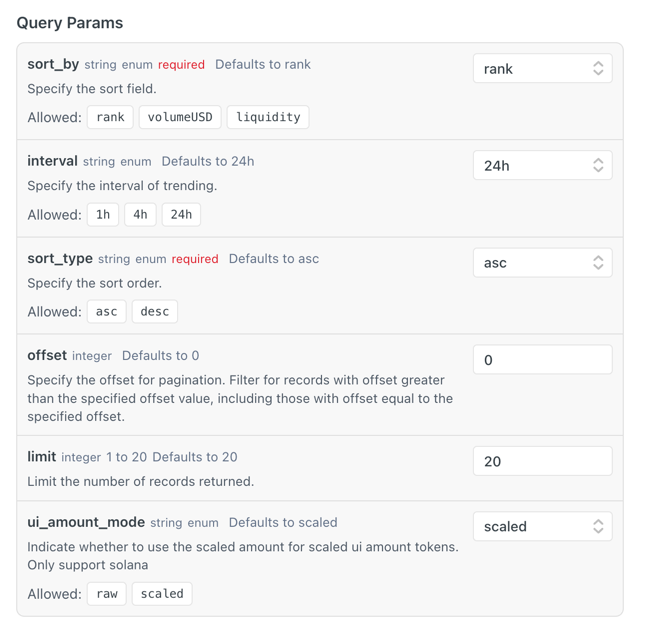
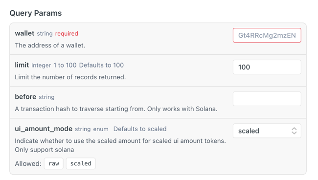

我想让你帮我创建一个数据存储的工程，数据源来自 dexscreener、birdeye
uvicorn app.main:app --reload --host 0.0.0.0 --port 8000
# 1、创建mysql 数据库，表结构按每个接口返回参数存储到表中

# 2、获取“热门/趋势”代币数据

 接口地址 https://public-api.birdeye.so/defi/token_trending
 调用频率，每1小时
  
  返回参数：
  ```
  {
  "data": {
    "updateUnixTime": 1768029370,
    "updateTime": "2026-01-10T07:16:10",
    "tokens": [
      {
        "address": "DezXAZ8z7PnrnRJjz3wXBoRgixCa6xjnB7YaB1pPB263",
        "decimals": 5,
        "fdv": 917724472.8992932,
        "liquidity": 5336222.366194576,
        "logoURI": "https://arweave.net/hQiPZOsRZXGXBJd_82PhVdlM_hACsT_q6wqwf5cSY7I",
        "marketcap": 870447229.2527591,
        "name": "Bonk",
        "price": 0.000010429254534544984,
        "rank": 1,
        "symbol": "Bonk",
        "volume24hUSD": 3615086.3526675417,
        "volume24hChangePercent": 53.699300851890875,
        "price24hChangePercent": -4.409340989087892,
        "isScaledUiToken": false,
        "multiplier": null
      }
    ],
    "total": 7106
  },
  "success": true
}
  ```


# 3、birdeye 相关接口

	apiKey: 9c1c446225f246f69ec5ebd6103f1502

## 1、
	接口地址：https://public-api.birdeye.so/defi/txs/token/seek_by_time


headers = {
    "accept": "application/json",
    "x-chain": "solana",
    "X-API-KEY": "9c1c446225f246f69ec5ebd6103f1502"
}

	返回参数：
	{
  "data": {
    "items": [
      {
        "quote": {
          "symbol": "SOL",
          "decimals": 9,
          "address": "So11111111111111111111111111111111111111112",
          "amount": "4676700",
          "uiAmount": 0.0046767,
          "price": 139.48612659068803,
          "nearestPrice": 139.48612659068803,
          "changeAmount": -4676700,
          "uiChangeAmount": -0.0046767,
          "isScaledUiToken": false,
          "multiplier": null
        },
        "base": {
          "symbol": "SMARTBRICK",
          "decimals": 6,
          "address": "AgZEpxQKsyk4JKT2tnWwEdPDf9vxQdWm73pgWeDDpump",
          "amount": "148138158503",
          "uiAmount": 148138.158503,
          "price": 0.000004403556617814039,
          "nearestPrice": 0.000004404306259213903,
          "changeAmount": 148138158503,
          "uiChangeAmount": 148138.158503,
          "isScaledUiToken": false,
          "multiplier": null
        },
        "basePrice": 0.000004403556617814039,
        "quotePrice": 139.48612659068803,
        "txHash": "3LKp8U3hy1izeZ8hEXMMSQcQMmj3PZGCLM95A3vGhGzGftGsYxMFCKm6aFxCUDtzWK6EiWLH35Pbj4i1dMQhBVau",
        "source": "pump_dot_fun",
        "blockUnixTime": 1767929628,
        "txType": "swap",
        "owner": "54Pz1e35z9uoFdnxtzjp7xZQoFiofqhdayQWBMN7dsuy",
        "side": "buy",
        "alias": null,
        "pricePair": 3.156985375854588e-8,
        "from": {
          "symbol": "SOL",
          "decimals": 9,
          "address": "So11111111111111111111111111111111111111112",
          "amount": "4676700",
          "uiAmount": 0.0046767,
          "price": 139.48612659068803,
          "nearestPrice": 139.48612659068803,
          "changeAmount": -4676700,
          "uiChangeAmount": -0.0046767,
          "isScaledUiToken": false,
          "multiplier": null
        },
        "to": {
          "symbol": "SMARTBRICK",
          "decimals": 6,
          "address": "AgZEpxQKsyk4JKT2tnWwEdPDf9vxQdWm73pgWeDDpump",
          "amount": "148138158503",
          "uiAmount": 148138.158503,
          "price": 0.000004403556617814039,
          "nearestPrice": 0.000004404306259213903,
          "changeAmount": 148138158503,
          "uiChangeAmount": 148138.158503,
          "isScaledUiToken": false,
          "multiplier": null
        },
        "tokenPrice": 0.000004403556617814039,
        "poolId": "CpRvwYCg3hfk4h8iS8Sx2WCx3eADpt6VDtg9LUABVTSH"
      }
    ],
    "hasNext": true
  },
  "success": true
}

## 2、 查询某个币赚钱最多的钱包地址

接口地址：https://public-api.birdeye.so/defi/v2/tokens/top_traders

返回参数：
{
  "success": true,
  "data": {
    "items": [
      {
        "tokenAddress": "AgZEpxQKsyk4JKT2tnWwEdPDf9vxQdWm73pgWeDDpump",
        "owner": "8XKhq1Ygeznsx54sTHvdjhvLXDM8j2oJeqknd1kRpBjQ",
        "tags": [],
        "type": "24h",
        "volume": 409193670.3284158,
        "trade": 92,
        "tradeBuy": 46,
        "tradeSell": 46,
        "volumeBuy": 204596835.1642079,
        "volumeSell": 204596835.1642079,
        "isScaledUiToken": false,
        "multiplier": null
      }
    ]
  }
}

## 3、查询某个钱包地址的历史交易接口
接口地址：https://public-api.birdeye.so/v1/wallet/tx_list
headers = {
    "accept": "application/json",
    "x-chain": "solana",
    "X-API-KEY": "9c1c446225f246f69ec5ebd6103f1502"
}


before 参数的含义
字面意思：在...之前。
技术含义：分页游标 (Cursor)。它代表一个参照点。
具体逻辑：当你传入一个 txHash（交易哈希）给 before 参数时，Birdeye 会去查找这个交易，然后返回排在这个交易 “之后”（即时间上更早/更旧） 的下一批交易数据。
适用场景：当你需要遍历（Traverse）一个钱包的历史交易记录时。

返回参数：
{
  "success": true,
  "data": {
    "solana": [
      {
        "txHash": "4CPJpkA8zSdNH5JusVfT9pGJ5w6xfNae2MU6CQDSAfaJMU7ZtBQmWnohdUCDsqq3UgRnDCa8m7cLPXuvPMCmkV8m",
        "blockNumber": 392293566,
        "blockTime": "2026-01-09T06:31:53+00:00",
        "status": true,
        "from": "8XKhq1Ygeznsx54sTHvdjhvLXDM8j2oJeqknd1kRpBjQ",
        "to": "11111111111111111111111111111111",
        "fee": 127223,
        "mainAction": "unknown",
        "balanceChange": [
          {
            "amount": -502601304,
            "symbol": "SOL",
            "name": "Wrapped SOL",
            "decimals": 9,
            "address": "So11111111111111111111111111111111111111112",
            "logoURI": "https://raw.githubusercontent.com/solana-labs/token-list/main/assets/mainnet/So11111111111111111111111111111111111111112/logo.png",
            "isScaledUiToken": false,
            "multiplier": null
          },
          {
            "tokenAccount": "Cj9jhZJCvp1RrU1Bgsj31ahichM7iTzQx5pzARzLnag1",
            "owner": "8XKhq1Ygeznsx54sTHvdjhvLXDM8j2oJeqknd1kRpBjQ",
            "decimals": 6,
            "programId": "TokenzQdBNbLqP5VEhdkAS6EPFLC1PHnBqCXEpPxuEb",
            "amount": 13613000375535,
            "address": "AESuEeFpb76U2CLcMRBS5kBoQmu3A2KBRLTYHd4Gpump",
            "name": "MELLO",
            "symbol": "MELLO",
            "logoURI": "https://ipfs.io/ipfs/bafkreihrnlwnrgadirqefp4khuit5tc7mykwmsnip7np3ql5dytiag6wyi",
            "isScaledUiToken": false,
            "multiplier": null
          }
        ],
        "contractLabel": {
          "address": "11111111111111111111111111111111",
          "name": "System Program",
          "metadata": {
            "icon": ""
          }
        },
        "tokenTransfers": [
          {
            "fromTokenAccount": "8XKhq1Ygeznsx54sTHvdjhvLXDM8j2oJeqknd1kRpBjQ",
            "toTokenAccount": "FLAshyAyBcKb39KPxSzXcepiS8iDYUhDGwJcJDPX4g2B",
            "fromUserAccount": "8XKhq1Ygeznsx54sTHvdjhvLXDM8j2oJeqknd1kRpBjQ",
            "toUserAccount": "FLAshyAyBcKb39KPxSzXcepiS8iDYUhDGwJcJDPX4g2B",
            "tokenAmount": 0.0004,
            "mint": "So11111111111111111111111111111111111111111",
            "transferNative": true,
            "isScaledUiToken": false,
            "multiplier": null
          },
          {
            "fromTokenAccount": "5uGZ5EJbWLS215mhCCNcP1nw6EwT6xMJQViVFpmjsXHX",
            "toTokenAccount": "Cj9jhZJCvp1RrU1Bgsj31ahichM7iTzQx5pzARzLnag1",
            "fromUserAccount": "2LXh1BTSsN8KPHsb8RY3jDb2DBPoSo1fG333Lij4LCJL",
            "toUserAccount": "8XKhq1Ygeznsx54sTHvdjhvLXDM8j2oJeqknd1kRpBjQ",
            "tokenAmount": 13613000.375535,
            "mint": "AESuEeFpb76U2CLcMRBS5kBoQmu3A2KBRLTYHd4Gpump",
            "transferNative": false,
            "isScaledUiToken": false,
            "multiplier": null
          },
          {
            "fromTokenAccount": "8XKhq1Ygeznsx54sTHvdjhvLXDM8j2oJeqknd1kRpBjQ",
            "toTokenAccount": "9VcTLqMMcYuEjS9JTgNDYvrbeQibpRNT6MfsDQxtyZKW",
            "fromUserAccount": "8XKhq1Ygeznsx54sTHvdjhvLXDM8j2oJeqknd1kRpBjQ",
            "toUserAccount": "9VcTLqMMcYuEjS9JTgNDYvrbeQibpRNT6MfsDQxtyZKW",
            "tokenAmount": 0.001481482,
            "mint": "So11111111111111111111111111111111111111111",
            "transferNative": true,
            "isScaledUiToken": false,
            "multiplier": null
          },
          {
            "fromTokenAccount": "8XKhq1Ygeznsx54sTHvdjhvLXDM8j2oJeqknd1kRpBjQ",
            "toTokenAccount": "2LXh1BTSsN8KPHsb8RY3jDb2DBPoSo1fG333Lij4LCJL",
            "fromUserAccount": "8XKhq1Ygeznsx54sTHvdjhvLXDM8j2oJeqknd1kRpBjQ",
            "toUserAccount": "2LXh1BTSsN8KPHsb8RY3jDb2DBPoSo1fG333Lij4LCJL",
            "tokenAmount": 0.49382716,
            "mint": "So11111111111111111111111111111111111111111",
            "transferNative": true,
            "isScaledUiToken": false,
            "multiplier": null
          },
          {
            "fromTokenAccount": "8XKhq1Ygeznsx54sTHvdjhvLXDM8j2oJeqknd1kRpBjQ",
            "toTokenAccount": "62qc2CNXwrYqQScmEdiZFFAnJR262PxWEuNQtxfafNgV",
            "fromUserAccount": "8XKhq1Ygeznsx54sTHvdjhvLXDM8j2oJeqknd1kRpBjQ",
            "toUserAccount": "62qc2CNXwrYqQScmEdiZFFAnJR262PxWEuNQtxfafNgV",
            "tokenAmount": 0.004691359,
            "mint": "So11111111111111111111111111111111111111111",
            "transferNative": true,
            "isScaledUiToken": false,
            "multiplier": null
          }
        ]
      }
    ]
  }
}


## 4、查询钱包地址的投资组合
接口地址：https://public-api.birdeye.so/v1/wallet/token_list


返回参数：
{
  "success": true,
  "data": {
    "wallet": "8XKhq1Ygeznsx54sTHvdjhvLXDM8j2oJeqknd1kRpBjQ",
    "totalUsd": 1960.6994307642985,
    "items": [
 
      {
        "address": "2uGkh44dy1Sk7qctbTySsLMVzbe6gEyRjm1FozMSpump",
        "decimals": 6,
        "balance": 5210158608691,
        "uiAmount": 5210158.608691,
        "chainId": "solana",
        "name": "AFK",
        "symbol": "AFK",
        "icon": "https://ipfs.io/ipfs/bafkreigl4zqj77oe5j23rzgorzso4sudz66s2w2y2vosbwoc55b3ihtkoi",
        "logoURI": "https://ipfs.io/ipfs/bafkreigl4zqj77oe5j23rzgorzso4sudz66s2w2y2vosbwoc55b3ihtkoi",
        "priceUsd": 0.000014058062399305525,
        "valueUsd": 73.24473483125695,
        "isScaledUiToken": false,
        "multiplier": null
      }
    ]
  }
}


## 5、查询最近新上币的接口
接口地址：https://public-api.birdeye.so/defi/v2/tokens/new_listing

返回参数：
{
  "success": true,
  "data": {
    "items": [
      {
        "address": "53pUZa4TPwh1HmQpT44wEjHjwDwmX6sM2ZtBsVXLdtDH",
        "symbol": "TikTok",
        "name": "TikTok coin🔥",
        "decimals": 6,
        "source": "meteora_dynamic_bonding_curve",
        "liquidityAddedAt": "2026-01-09T07:21:51",
        "logoURI": null,
        "liquidity": 24463.986839612193
      }
    ]
  }
}

## 6、判断币是不是貔貅币
接口地址：https://public-api.birdeye.so/defi/token_security

返回参数：
{
"data": {
"creatorAddress": "FhVo3mqL8PW5pH5U2CN4XE33DokiyZnUwuGpH2hmHLuM",
"creatorOwnerAddress": "11111111111111111111111111111111",
"ownerAddress": null,
"ownerOfOwnerAddress": null,
"creationTx": "2KKeatkDmTkynucvotmE8p5apZ8dcropyrqzvE5dnbuBkHNtahHec8ddPthW37E4WXcjAF8jnPBqfX4jcXk3nWJL",
"creationTime": 1767943311,
"creationSlot": 392301038,
"mintTx": "2KKeatkDmTkynucvotmE8p5apZ8dcropyrqzvE5dnbuBkHNtahHec8ddPthW37E4WXcjAF8jnPBqfX4jcXk3nWJL",
"mintTime": 1767943311,
"mintSlot": 392301038,
"creatorBalance": 252374429.331078,
"ownerBalance": null,
"ownerPercentage": null,
"creatorPercentage": null,
"metaplexUpdateAuthority": "11111111111111111111111111111111",
"metaplexOwnerUpdateAuthority": null,
"metaplexUpdateAuthorityBalance": null,
"metaplexUpdateAuthorityPercent": null,
"mutableMetadata": false,
"top10HolderBalance": 1000000000,
"top10HolderPercent": null,
"top10UserBalance": 0,
"top10UserPercent": null,
"isTrueToken": null,
"totalSupply": null,
"preMarketHolder": [],
"lockInfo": null,
"freezeable": null,
"freezeAuthority": null,
"transferFeeEnable": null,
"transferFeeData": null,
"isToken2022": false,
"nonTransferable": null
},
"success": true,
"statusCode": 200
}


## 7、查看币的流动性
接口地址：https://public-api.birdeye.so/defi/token_overview


返回参数：
{
  "data": {
    "address": "53pUZa4TPwh1HmQpT44wEjHjwDwmX6sM2ZtBsVXLdtDH",
    "marketCap": 217434.45909475625,
    "fdv": 217434.45909475625,
    "extensions": {},
    "liquidity": 48858.48489107215,
    "lastTradeUnixTime": 1767943865,
    "lastTradeHumanTime": "2026-01-09T07:31:05",
    "price": 0.00021743445909475626,
    "history1mPrice": 0.00021743445909475626,
    "priceChange1mPercent": 0,
    "history5mPrice": 0.00021743445909475626,
    "priceChange5mPercent": 0,
    "history30mPrice": 0.00001626735679948939,
    "priceChange30mPercent": 1236.6305403812205,
    "history1hPrice": 0.00001626735679948939,
    "priceChange1hPercent": 1236.6305403812205,
    "history2hPrice": 0.00001626735679948939,
    "priceChange2hPercent": 1236.6305403812205,
    "history4hPrice": 0.00001626735679948939,
    "priceChange4hPercent": 1236.6305403812205,
    "history6hPrice": 0.00001626735679948939,
    "priceChange6hPercent": 1236.6305403812205,
    "history8hPrice": 0.00001626735679948939,
    "priceChange8hPercent": 1236.6305403812205,
    "history12hPrice": 0.00001626735679948939,
    "priceChange12hPercent": 1236.6305403812205,
    "history24hPrice": 0.00001626735679948939,
    "priceChange24hPercent": 1236.6305403812205,
    "uniqueWallet1m": 0,
    "uniqueWalletHistory1m": 0,
    "uniqueWallet1mChangePercent": null,
    "uniqueWallet5m": 0,
    "uniqueWalletHistory5m": 0,
    "uniqueWallet5mChangePercent": null,
    "uniqueWallet30m": 108,
    "uniqueWalletHistory30m": 0,
    "uniqueWallet30mChangePercent": null,
    "uniqueWallet1h": 108,
    "uniqueWalletHistory1h": 0,
    "uniqueWallet1hChangePercent": null,
    "uniqueWallet2h": 108,
    "uniqueWalletHistory2h": 0,
    "uniqueWallet2hChangePercent": null,
    "uniqueWallet4h": 108,
    "uniqueWalletHistory4h": 0,
    "uniqueWallet4hChangePercent": null,
    "uniqueWallet8h": 108,
    "uniqueWalletHistory8h": 0,
    "uniqueWallet8hChangePercent": null,
    "uniqueWallet24h": 108,
    "uniqueWalletHistory24h": 0,
    "uniqueWallet24hChangePercent": null,
    "totalSupply": 1000000000,
    "circulatingSupply": 1000000000,
    "holder": 3,
    "trade1m": 0,
    "tradeHistory1m": 0,
    "trade1mChangePercent": null,
    "sell1m": 0,
    "sellHistory1m": 0,
    "sell1mChangePercent": null,
    "buy1m": 0,
    "buyHistory1m": 0,
    "buy1mChangePercent": null,
    "v1m": 0,
    "v1mUSD": 0,
    "vHistory1m": 0,
    "vHistory1mUSD": 0,
    "v1mChangePercent": null,
    "vBuy1m": 0,
    "vBuy1mUSD": 0,
    "vBuyHistory1m": 0,
    "vBuyHistory1mUSD": 0,
    "vBuy1mChangePercent": null,
    "vSell1m": 0,
    "vSell1mUSD": 0,
    "vSellHistory1m": 0,
    "vSellHistory1mUSD": 0,
    "vSell1mChangePercent": null,
    "trade5m": 0,
    "tradeHistory5m": 0,
    "trade5mChangePercent": null,
    "sell5m": 0,
    "sellHistory5m": 0,
    "sell5mChangePercent": null,
    "buy5m": 0,
    "buyHistory5m": 0,
    "buy5mChangePercent": null,
    "v5m": 0,
    "v5mUSD": 0,
    "vHistory5m": 0,
    "vHistory5mUSD": 0,
    "v5mChangePercent": null,
    "vBuy5m": 0,
    "vBuy5mUSD": 0,
    "vBuyHistory5m": 0,
    "vBuyHistory5mUSD": 0,
    "vBuy5mChangePercent": null,
    "vSell5m": 0,
    "vSell5mUSD": 0,
    "vSellHistory5m": 0,
    "vSellHistory5mUSD": 0,
    "vSell5mChangePercent": null,
    "trade30m": 625,
    "tradeHistory30m": 0,
    "trade30mChangePercent": null,
    "sell30m": 15,
    "sellHistory30m": 0,
    "sell30mChangePercent": null,
    "buy30m": 610,
    "buyHistory30m": 0,
    "buy30mChangePercent": null,
    "v30m": 883520646.0775819,
    "v30mUSD": 25957.38674236947,
    "vHistory30m": 0,
    "vHistory30mUSD": 0,
    "v30mChangePercent": null,
    "vBuy30m": 881517309.9513929,
    "vBuy30mUSD": 25842.525331938545,
    "vBuyHistory30m": 0,
    "vBuyHistory30mUSD": 0,
    "vBuy30mChangePercent": null,
    "vSell30m": 2003336.1261890004,
    "vSell30mUSD": 114.86141043092519,
    "vSellHistory30m": 0,
    "vSellHistory30mUSD": 0,
    "vSell30mChangePercent": null,
    "trade1h": 625,
    "tradeHistory1h": 0,
    "trade1hChangePercent": null,
    "sell1h": 15,
    "sellHistory1h": 0,
    "sell1hChangePercent": null,
    "buy1h": 610,
    "buyHistory1h": 0,
    "buy1hChangePercent": null,
    "v1h": 883520646.0775819,
    "v1hUSD": 25957.38674236947,
    "vHistory1h": 0,
    "vHistory1hUSD": 0,
    "v1hChangePercent": null,
    "vBuy1h": 881517309.9513929,
    "vBuy1hUSD": 25842.525331938545,
    "vBuyHistory1h": 0,
    "vBuyHistory1hUSD": 0,
    "vBuy1hChangePercent": null,
    "vSell1h": 2003336.1261890004,
    "vSell1hUSD": 114.86141043092519,
    "vSellHistory1h": 0,
    "vSellHistory1hUSD": 0,
    "vSell1hChangePercent": null,
    "trade2h": 625,
    "tradeHistory2h": 0,
    "trade2hChangePercent": null,
    "sell2h": 15,
    "sellHistory2h": 0,
    "sell2hChangePercent": null,
    "buy2h": 610,
    "buyHistory2h": 0,
    "buy2hChangePercent": null,
    "v2h": 883520646.0775819,
    "v2hUSD": 25957.38674236947,
    "vHistory2h": 0,
    "vHistory2hUSD": 0,
    "v2hChangePercent": null,
    "vBuy2h": 881517309.9513929,
    "vBuy2hUSD": 25842.525331938545,
    "vBuyHistory2h": 0,
    "vBuyHistory2hUSD": 0,
    "vBuy2hChangePercent": null,
    "vSell2h": 2003336.1261890004,
    "vSell2hUSD": 114.86141043092519,
    "vSellHistory2h": 0,
    "vSellHistory2hUSD": 0,
    "vSell2hChangePercent": null,
    "trade4h": 625,
    "tradeHistory4h": 0,
    "trade4hChangePercent": null,
    "sell4h": 15,
    "sellHistory4h": 0,
    "sell4hChangePercent": null,
    "buy4h": 610,
    "buyHistory4h": 0,
    "buy4hChangePercent": null,
    "v4h": 883520646.0775821,
    "v4hUSD": 25957.38674236945,
    "vHistory4h": 0,
    "vHistory4hUSD": 0,
    "v4hChangePercent": null,
    "vBuy4h": 881517309.9513931,
    "vBuy4hUSD": 25842.525331938527,
    "vBuyHistory4h": 0,
    "vBuyHistory4hUSD": 0,
    "vBuy4hChangePercent": null,
    "vSell4h": 2003336.1261890004,
    "vSell4hUSD": 114.86141043092519,
    "vSellHistory4h": 0,
    "vSellHistory4hUSD": 0,
    "vSell4hChangePercent": null,
    "trade8h": 625,
    "tradeHistory8h": 0,
    "trade8hChangePercent": null,
    "sell8h": 15,
    "sellHistory8h": 0,
    "sell8hChangePercent": null,
    "buy8h": 610,
    "buyHistory8h": 0,
    "buy8hChangePercent": null,
    "v8h": 883520646.0775821,
    "v8hUSD": 25957.38674236945,
    "vHistory8h": 0,
    "vHistory8hUSD": 0,
    "v8hChangePercent": null,
    "vBuy8h": 881517309.9513931,
    "vBuy8hUSD": 25842.525331938527,
    "vBuyHistory8h": 0,
    "vBuyHistory8hUSD": 0,
    "vBuy8hChangePercent": null,
    "vSell8h": 2003336.1261890004,
    "vSell8hUSD": 114.86141043092519,
    "vSellHistory8h": 0,
    "vSellHistory8hUSD": 0,
    "vSell8hChangePercent": null,
    "trade24h": 625,
    "tradeHistory24h": 0,
    "trade24hChangePercent": null,
    "sell24h": 15,
    "sellHistory24h": 0,
    "sell24hChangePercent": null,
    "buy24h": 610,
    "buyHistory24h": 0,
    "buy24hChangePercent": null,
    "v24h": 883520646.0775821,
    "v24hUSD": 25957.38674236945,
    "vHistory24h": 0,
    "vHistory24hUSD": 0,
    "v24hChangePercent": null,
    "vBuy24h": 881517309.9513931,
    "vBuy24hUSD": 25842.525331938527,
    "vBuyHistory24h": 0,
    "vBuyHistory24hUSD": 0,
    "vBuy24hChangePercent": null,
    "vSell24h": 2003336.1261890004,
    "vSell24hUSD": 114.86141043092519,
    "vSellHistory24h": 0,
    "vSellHistory24hUSD": 0,
    "vSell24hChangePercent": null,
    "numberMarkets": 2,
    "isScaledUiToken": false,
    "multiplier": null
  },
  "success": true
}
